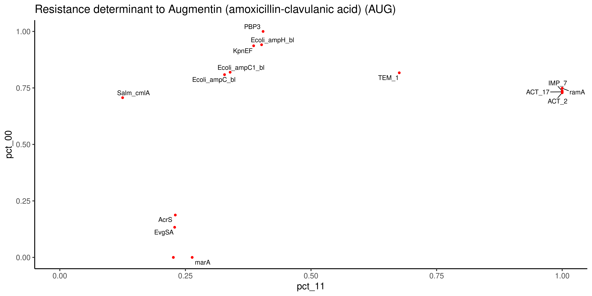

# arg_ast : R code to unreveal phenotype genotype associations


<p align="left"></p>


## Installation

```shell
git clone https://github.com/soda460/arg_ast
```

If need install these R libraries in R

```R
install.packages('tidyverse')
install.packages('ggplot2')
install.packages('ggrepel')

# optional
install.packages('svglite')
```

## Usage

Don't use data_wrangling.R. Rather, try to fit your phenotype and genotype data to the format of the csv files loaded by the main program : arg_ast.R


## Contributors

  * Jean-Simon Brouard, Ph.D.  
Biologist in bioinformatics, Science and Technology Branch  
Agriculture and Agri-Food Canada / Government of Canada  
jean-simon.brouard@canada.ca


  * Dominic Poulin-Laprade, Ph.D.  
Research Scientist, Science and Technology Branch  
Agriculture and Agri-Food Canada / Government of Canada  
Dominic.Poulin-Laprade@Canada.ca


## Notes

Technically, this script is also useful for me because it make use of quosure objects in R functions.


